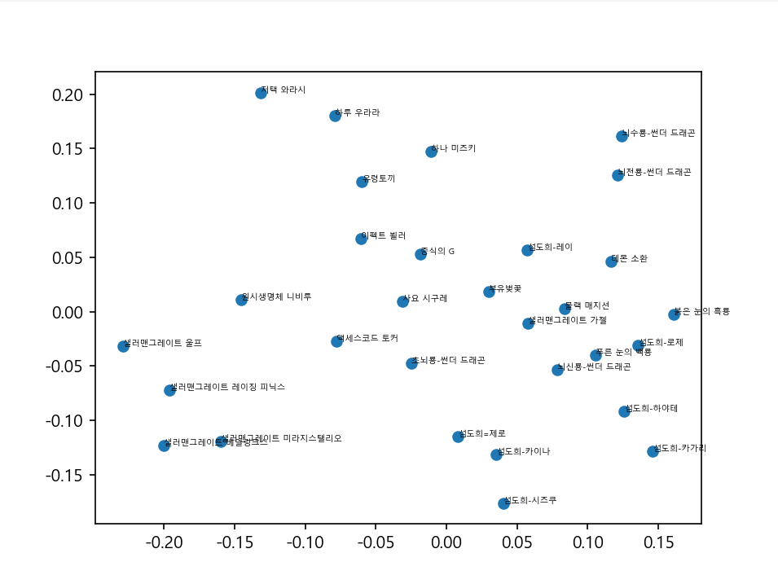

# Yu-Gi-Oh-Cosine-similarity-Project

## 유희왕에서 사용되는 카드들을 임베딩 후 Cosine similarity를 적용하는 프로젝트
- 모든 카드를 임베딩하는 것은 불가능 -> 특정 기준으로 선정 필요
- 시각화 필요
    - PCA이용
    - bertvise 이용하여 각 head에서의 관계도 확인하고픔
- feature와 text를 하나의 text로 합칠 것인지, 따로 임베딩 할 것인지

## 실험 결과 및 기록 사항
- 2025/12/14 00:50
    - 모든 respone을 첨부하여 embedding
    - 목적에 부합하지 않는 결과가 나옴

- 2025/12/14 12:00
    - feature+text 임베딩 확인하기로 결정
    - 3D 산점도 파일 추가
        - 솔직히 보기 좀 힘든듯

- 2025/12/14 23:00
    - 기존에 사용하던 API로 가져오는 방식에서 ATK, DEF가 모두 Null로 나오는 현상 발견
    - 2024년 7월 28일 기준 작성된 TCG Kaggle csv dataset 발견
        - https://www.kaggle.com/datasets/ioexception/yugioh-cards
        - 최신화 되어있지 않아 K9과 같은 카드군 존재하지 않음
        - 영문 데이터라 한글 임베딩과는 다를 가능성 농후
        - 공/수 데이터 존재
- 2025/12/17 00:10
    - 기존 API 방식에 ATK, DEF 나오게 수정 (div.atkdef 태그 추가)
    - 공/수 적용되니 임베딩 변경됨
    - 샐러맨그레이트 레이징 피닉스, 섬도희=제로 추가
    - 패트랩 왼쪽 위 / 샐러맨그레이트 왼쪽 아래 / 섬도희 오른쪽 아래 / 썬더 드래곤 오른쪽 위

    
