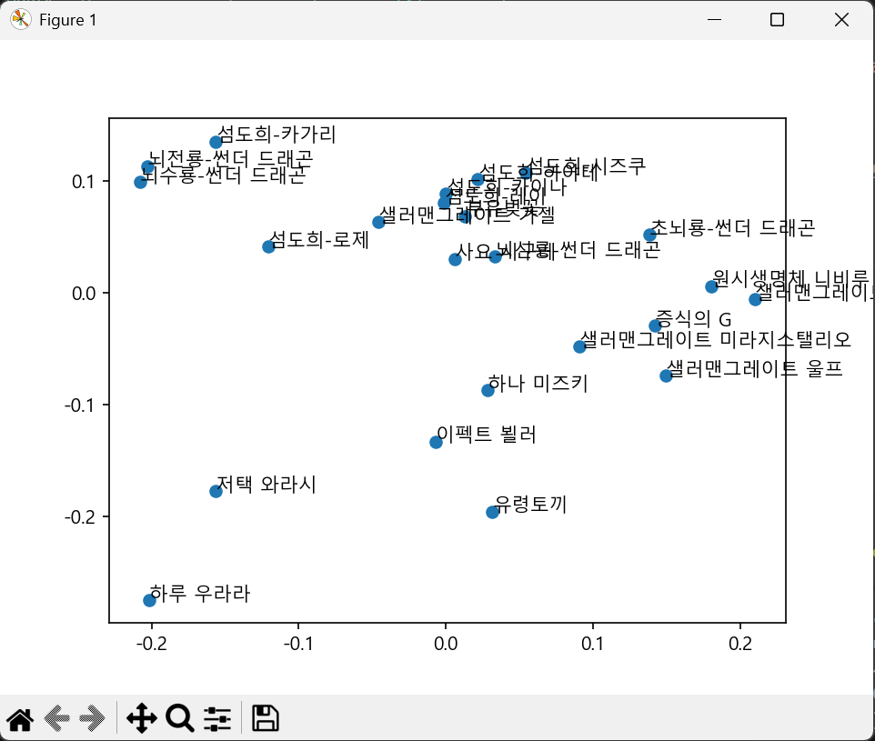

# Yu-Gi-Oh-Cosine-similarity-Project

## 유희왕에서 사용되는 카드들을 임베딩 후 Cosine similarity를 적용하는 프로젝트
- 모든 카드를 임베딩하는 것은 불가능 -> 특정 기준으로 선정 필요
- 시각화 필요
    - PCA이용
    - bertvise 이용하여 각 head에서의 관계도 확인하고픔
- feature와 text를 하나의 text로 합칠 것인지, 따로 임베딩 할 것인지

## 실험 결과
- 2025/12/14 00:50
    - 모든 respone을 첨부하여 embedding
    - 목적에 부합하지 않는 결과가 나옴

- 2025/12/14 
